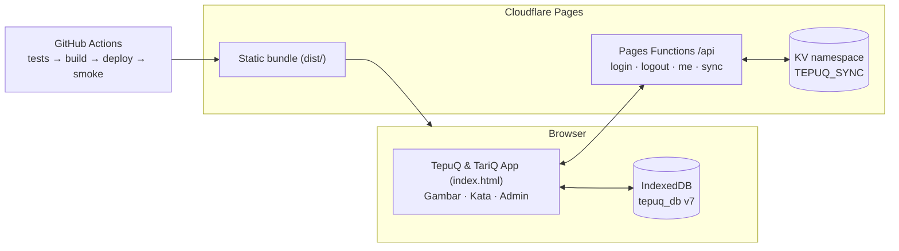
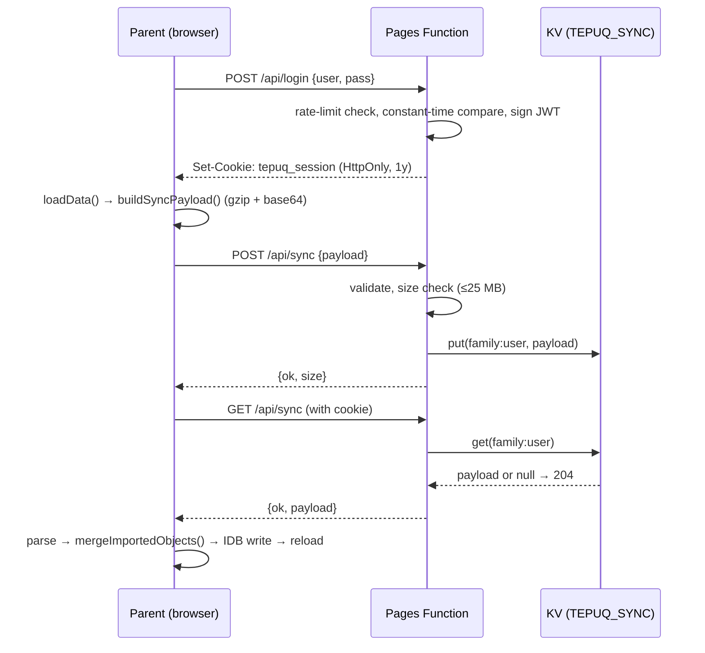

# TepuQ & TariQ — Architecture

TepuQ & TariQ is a browser-first toddler game shell. "TepuQ" means *tap* and "TariQ" means *drag*. One page hosts two games (TepuQ Gambar and TariQ Kata), a shared admin mode, and an optional family cloud sync. All gameplay data lives in the browser's IndexedDB; the cloud is only a backup/sync store for custom objects and settings.

## 1. Architecture Diagram



## 2. Tech Stack

| Layer | Technology | Why |
|---|---|---|
| Build tool | Vite 5 | Fast dev server, single static bundle |
| Runtime | Bun | Package manager + test runner companion |
| Language | Vanilla JavaScript (ESM) + HTML + CSS | No framework; keeps the app light and simple for a toddler game |
| Local storage | IndexedDB (`tepuq_db`) | Blob storage for photos/recordings; one DB shared by both games |
| Speech | Web Speech API (`id-ID` TTS) + MediaRecorder | Default TTS; parents can record their own voice per object |
| ZIP export/import | JSZip (npm, lazy-loaded chunk) | Backup & device migration |
| Cloud sync | Cloudflare Pages Functions + KV | Free tier, sub-ms access, zero database ops |
| Auth | Hand-rolled JWT (HS256 via Web Crypto), HttpOnly cookie | No auth library needed for a single shared family credential |
| Compression | `CompressionStream`/`DecompressionStream` (gzip) | Shrinks the sync payload before it hits KV |
| Tests | Vitest (unit) + Playwright (E2E) | BDD-style suites, run in CI before deploy |
| Deployment | GitHub Actions → Cloudflare Pages | Push to `main` = test, build, deploy |

## 3. Project Structure

```
TepuQ/
├── index.html                    # Single-page shell: Game Picker + both games + admin
├── functions/api/                # Cloudflare Pages Functions (sync backend)
│   ├── _utils.js                 # JWT sign/verify, cookies, KV keys, JSON helpers
│   ├── login.js                  # Family credential check → JWT cookie (rate-limited)
│   ├── logout.js                 # Clears session cookie
│   ├── me.js                     # Session status for the sync UI
│   └── sync.js                   # GET (pull) / POST (push) single KV payload per family
├── scripts/run-e2e.js            # Dynamic-port E2E runner
├── src/
│   ├── main.js                   # Bootstrap: admin vs game; seeds, speech init, boot storm
│   ├── game-picker.js            # Top-level menu; routes into Gambar or Kata (ADR 0002)
│   ├── config.js                 # Defaults + constants; DB_VERSION (cache-busting)
│   ├── db.js                     # IndexedDB: stores, seeding, Kata adapter, migrations
│   ├── utils.js                  # Shared helpers (toast, resize, blob utils)
│   ├── speech.js                 # TTS wrapper + recorded audio, shared by both games
│   ├── sync-client.js            # Shared sync API client (login/pull/me); keep out of admin layer
│   ├── gambar-game/              # TepuQ Gambar (original card game, renamed)
│   │   ├── mode-manager.js       # Bebas/Target sub-picker, startMode
│   │   ├── logic.js              # Core rules: card advancement, burst window
│   │   ├── game-state.js         # Centralized mutable game state
│   │   ├── input.js              # Keyboard/touch/pointer handlers (mobile-safe)
│   │   ├── card.js               # Card rendering, object URLs, no-border rule
│   │   ├── demo.js               # Background demo cards on the mode picker
│   │   ├── animations.js         # Card animations
│   │   ├── background.js         # Background styling per settings
│   │   ├── effects.js            # Particle/burst effects
│   │   ├── fullscreen.js         # Fullscreen toggling
│   │   └── index.js              # Gambar entry point
│   ├── kata-game/                # TariQ Kata (spelling game)
│   │   ├── index.js              # Game loop + state machine wiring
│   │   ├── game-state.js         # LOADING/PLAYING/VICTORY state machine
│   │   ├── slots.js              # Pure slot derivation + snap hit-testing
│   │   ├── drag-engine.js        # Touch + mouse drag with magnetic snap
│   │   ├── renderer.js           # DOM: slots, tiles, photo, confetti, win screen
│   │   └── audio.js              # TTS letters/word + success chime
│   ├── admin/                    # SHARED admin chrome (one page, per-game tabs)
│   │   ├── index.js              # Admin shell: Objek/Sinkron + editor tabs
│   │   ├── editor.js             # Shared object editor ("Aktif di TariQ Kata" toggle)
│   │   ├── object-list.js        # Object list with Kata badge + drag reorder
│   │   ├── import-export.js      # ZIP export/import (objects carry kataEnabled)
│   │   ├── sync.js               # Cloud sync UI: login/push/pull/logout
│   │   ├── sync-serializer.js    # Payload build/parse (gzip → base64 string)
│   │   └── merge-objects.js      # Import/sync merge strategy
│   ├── gambar-admin/             # Gambar settings tab
│   │   └── settings-form.js
│   ├── kata-admin/               # Kata settings tab
│   │   └── settings-form.js      # Letter/slot/snap/session settings
│   └── styles/                   # base / gameplay / theme / admin / kata CSS
├── public/
│   └── assets/                   # Bundled CC0 starter images (WebP) + SFX (cache-busted by DB_VERSION)
├── tests/
│   ├── unit/                     # Vitest (logic, slots, sync, serializers, settings…)
│   └── e2e/                      # Playwright (game, kata, admin, sync, deploy smoke)
├── docs/
│   ├── architecture.md           # This document
│   ├── adr/                      # Architecture Decision Records (0001–0005)
│   └── assets-sources.md         # Starter media provenance/licensing
├── AGENTS.md                     # Agent & contributor guide
├── CONTEXT.md                    # Domain glossary (English)
└── .github/workflows/
    ├── deploy.yml                # unit tests → build → KV provision → Pages deploy
    └── deploy-smoke.yml          # Playwright smoke against the live pages.dev
```

### Key design points

- **One database, many stores.** `tepuq_db` (v7) holds `objects`, `settings`, `meta` (shared), plus `kata_settings` and `kata_progress`. Since v7 there is no `kata_words` store: TariQ Kata reads its words from the shared `objects` store through `loadKataWordsFromObjects()` in `src/db.js:340` (ADR 0005). Each object carries `active` (Gambar) and `kataEnabled` (Kata) toggles; multi-word names are auto-excluded from Kata.
- **Browser-first.** Everything works offline with zero configuration. Cloud sync is an add-on, never a requirement.
- **Starter media is cache-busted by `DB_VERSION`.** Starter images are served as plain URLs (`?v=<DB_VERSION>`); bumping the version in `src/config.js` invalidates stale caches for every browser on the next load.
- **Mobile-safe input.** `src/gambar-game/input.js` only calls `preventDefault()` during actual gameplay; the mode picker and all native UI (forms, links, inputs) keep native click behavior (see AGENTS.md "Tap / Click Must Work on Mobile").

## 4. Sync Mechanism

### Model

- **Unit of identity: the Family.** One shared username/password pair, configured as Cloudflare secrets (`TEPUQ_USER`, `TEPUQ_PASS`). There is no per-person identity (ADR 0001).
- **Exactly one Sync Store per family**: a single KV value under key `family:<username>`. The value is one string: the whole custom data set serialized to JSON, gzip-compressed, and base64-encoded (`gz:` or `raw:` prefix).
- **Push/pull are explicit and manual** — no automatic sync, so the toddler's device never mutates data behind the parent's back.

### What syncs

- Custom objects only (`source === 'custom'`), including photo Blobs and voice recordings as base64, plus each object's `kataEnabled` toggle (ADR 0005 — the shared word/photo library syncs as one unit).
- Settings (`kataEnabled` rides on objects; Kata settings live in `kata_settings` but are **not** part of the sync payload; Kata progress is per-device and never syncs).
- Starter objects and per-device progress never sync; they are assumed identical on every device.

### Payload format

```jsonc
{
  "version": "3.0",
  "partial": true,
  "exportMode": "custom-only",
  "settings": { /* shared settings */ },
  "objects": [
    {
      "id": "obj_001", "name": "mama", "ttsText": "mama",
      "image": "images/obj_001.png", "imageData": "<base64>",
      "audio": "audio/obj_001.webm", "audioData": "<base64>",
      "useRecording": true, "audioType": "recording",
      "active": true, "kataEnabled": true, "order": 0, "keyBindings": [],
      "source": "custom"
    }
  ]
}
```

Built by `buildSyncPayload()` in `src/admin/sync-serializer.js:8`, compressed, and sent as a single string.

### Flow

1. **Login** — Admin "Sinkron" tab (or the Game Picker login form) POSTs `{user, pass}` to `/api/login`. The worker rate-limits by IP (10 attempts / 15 min), compares credentials in constant time, and sets a 1-year HttpOnly `SameSite=Strict` JWT cookie (`tepuq_session`).
2. **Push** — `handlePush()` loads objects/settings from IndexedDB, calls `buildSyncPayload()` (custom-only, gzip+base64), and POSTs `{payload}` to `/api/sync`. The worker validates the string (shape only for legacy plain-JSON payloads), enforces a 25 MB KV limit, and stores it at `family:<user>`.
3. **Pull** — GET `/api/sync` returns the stored payload, or 204 when the store is empty. `applyPulledData()` merges via `mergeImportedObjects()` (same strategy as ZIP import: id/name matching, starter objects preserved), writes `objects` + `settings` + `meta` in one IndexedDB transaction, then reloads the page.
4. **Session check / logout** — `/api/me` reports login state for the UI; `/api/logout` clears the cookie.



### Security notes

- JWT is signed HS256 with `TEPUQ_JWT_SECRET` via Web Crypto; no external auth dependency.
- The cookie is `HttpOnly`, `Secure`, `SameSite=Strict` — JS can never read the token.
- Credentials live only in Cloudflare secrets, never in the repository or the bundle.
- Login is IP rate-limited in-process (per worker).
- Payload size is capped at 25 MB on the server.

### Deployment pipeline

Push to `main` triggers `.github/workflows/deploy.yml`:

1. `bun install` → unit tests (`bun run test:unit`) → build (`bun run build`).
2. Wrangler provisions the `TEPUQ_SYNC` KV namespace if missing and writes its ID into `wrangler.jsonc`.
3. Wrangler sets the three sync secrets on the Pages project.
4. `wrangler pages deploy dist` publishes to `https://tepuq.pages.dev`.

Afterwards `.github/workflows/deploy-smoke.yml` runs Playwright smoke tests (Gambar + Kata) against the live site and opens a GitHub issue on failure.